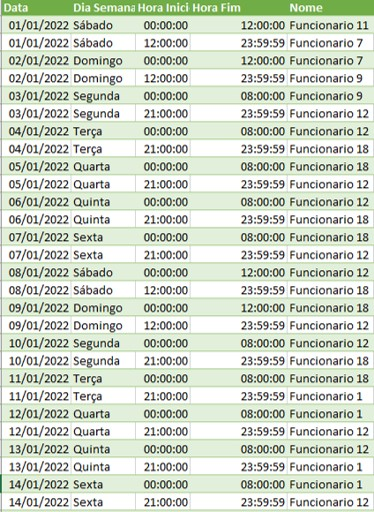

# Escalas de Sobreaviso Corporativas

### Curso de Pós Graduação BI Master - PUC/Rio
### Trabalho da disciplina Organização e Planejamento 
Autores: Gustavo Dutra Martins e Alex Marques Campos

<br/><br/>
## Definições
- Incidente é todo o evento adverso que gere impacto negativo, de forma concreta ou potencial, no efetivo e eficaz funcionamento de um sistema computacional.

- Equipes de tratamento de incidentes operam visando sanar incidentes no menor tempo possível.

- Incidentes de tipos específicos precisam ser corrigidos no menor tempo possível, para evitar impactos negativos ao negócio.

- Incidentes são tratados por equipes especializadas.

- Equipes especializadas são formadas por pessoas que possuem um conhecimento técnico específico e trabalham em escalas de trabalho específicas.

- Algumas equipes especializadas não operam em um regime 24x7.

- Incidentes relevantes ocorridos fora do horário de trabalho regular devem ser tratados de forma tempestiva, por equipes especializadas, em regime 24x7 ou em regime de sobreaviso.

<br/><br/>
## Motivação

- O regime de sobreaviso deve ser previsível e uma escala de trabalho, de cada equipe especializada, deve ser gerada de forma antecipada, para que o trabalho seja realizado.

- Aspectos legais devem ser observados na elaboração das escalas de trabalho em regime de sobreaviso.

- Deve existir equilíbrio entre a vida profissional e a vida pessoal de cada integrante de uma dada equipe de sobreaviso, para que o trabalho seja harmonioso e não seja mais estressante do que o necessário.

- Existe um critério de justiça na elaboração da escala de sobreaviso, visando a distribuição equânime do trabalho entre os integrantes de uma dada equipe de sobreaviso.

- O grau de incerteza do planejamento aumenta ao longo do tempo, por isso é esperada alguma medida de replanejamento das escalas ao longo da execução do serviço.

- Elaborar e atualizar uma escala de sobreaviso é uma atividade de planejamento que pode ser grandemente auxiliada pelo uso de sistemas computacionais adequados.

<br/><br/>
## Problema

- A equipe de sobreaviso é responsável por resolver incidentes que ocorrem fora do horário regular de trabalho.
- O funcionário sobreavisado deve estar disponível e responder em um curto tempo, após acionado.
- As escalas devem ser organizadas de forma a promover a distribuição mais justa possível.
- Deve-se ter especial atenção na distribuição de escalas em dias não úteis, principalmente feriados especiais (Natal, Ano Novo e Carnaval).
- O funcionário tem direito a informar bloqueios em sua agenda.
- Chamaremos de escala o turno de cobertura realizada pelo funcionário, onde existe um horário de início e término.	
- Pode-se utilizar sobreaviso para todos os dias ou somente não úteis. A cobertura para dias úteis ocorre após o expediente.
- **Gerador de Escala** - Gerar escala inicial através de rodizio, registrando bloqueios onde existir indisponibilidade. A geração não resolverá o bloqueio!
- **Otimizador de Bloqueios** - encontrar as substituições mais justas, levando em conta a disponibilidade da equipe para o dia do bloqueio e as regras de alocação.


<br/><br/>
## Escala Inicial
- Escolher a ordem de rotação de funcionários, ou seja, a ordem do vetor.
- Por 7 dias consecutivos (parametrizável) alternar par de funcionários.
- Quebrar a escala em partes quando mudar o dia ou o responsável.
- Registrar indisponibilidade (bloqueio), mas não trata-lo.
- Tratar dia útil com horário de inicio e término.
- Tratar dia não útil, com horário de troca.

<br/>


<br/><br/>
## Otimizador de Bloqueios 

 - Otimizar a busca pela solução mais justa utilizando algoritmos genéticos, onde cada individuo é um sobreaviso onde os bloqueios foram resolvidos


```]
 ....... Execução do Otimizador ......
```


<br/>
Impossível encontrar a solução somente com opções randômicas, as combinações são quase infinitas e as funções de restrição muito complexas.

<br/><br/>

## Função Objetivo

**Utilizar pesos diferentes para horas trabalhadas**
- Dia comum - menor peso.
- Final de semana -  um pouco maior
- Feriado - mais peso que os anteriores.
- Feriado especial - maior peso de todos.

**Desvio Padrão**
- Calcular o somatório ponderado das horas trabalhadas
- Quanto menor o desvio padrão mais justa é o conjunto de escalas

<br/><br/>

## Função Restrição
- Um funcionário não pode trabalhar mais que 24 horas seguidas.
- Um funcionário não pode trabalhar mais de dois dias seguidos, mesmo tendo trabalhado menos que 24 horas
- Na substituição deve-se tratar:<br/>
  - O responsável da escala anterior.<br/>
  - O responsável da escala posterior.<br/>
  - Os bloqueios dos outros funcionários.

- Inexistência de “meia escala”  Um bloqueio pode gerar uma indisponibilidade para um dia e se não tratado gerar meia escala. 

- Um funcionário não pode estar alocado no dia que informou indisponibilidade

<br/><br/>

## Geração de Individuos, Mutação e Cruzamento

- A grande quantidade de combinações possíveis e a complexidade das regras de restrição impediram o uso de funções randômicas “puras”. 

- Como solução optamos por “controlar” as possibilidades para alocação de funcionários nos bloqueios, selecionando somente aqueles que estariam aptos a efetivamente trabalhar na escala.

- A implementação foi realizada em Python, utilizando a biblioteca DEAP.

- A modelagem foi realizada em classes e por esse motivo as funções de cruzamento (mate) e mutação (mutate) foram adaptadas.


<br/><br/>

## Restrições da Solução

- Não pode existir bloqueio para o primeiro dia do ano (01/01) ou para o último (31/12).
- Não foi testada com períodos superiores a 12 meses.
- Não foi tratado o caso de um funcionário entrar durante o ano. <br/>
  -  que nesse caso deveria ser adicionada a média de horas trabalhadas até a data do seu ingresso na equipe, contudo esse problema não foi abordado.


<br/><br/>

## Resultado
**Contextualizando**
- Foram utilizados dados reais, mas os nomes foram anonimizados.
- A equipe trabalhava em dias úteis e não úteis.
- Existiam 94 bloqueios em uma escala entre 01/01/2022 e 31/12/2022.
- Os arquivos de controle – bloqueios, funcionários e feriados – foram anexados a solução.

Nosso melhor resultado foi obtido com uma população de 40 indivíduos em 40 gerações.

A ([escala inicial](escalas-geradas/escala-2022.csv))
 e o ([melhor resultado](escalas-geradas/best-escala-2022.csv)) foram armazenados em um arquivo excel, onde realçamos em amarelo as substituições ([comparativo-final-2022.xlsx](escalas-geradas/comparativo-final-2022.xlsx))

