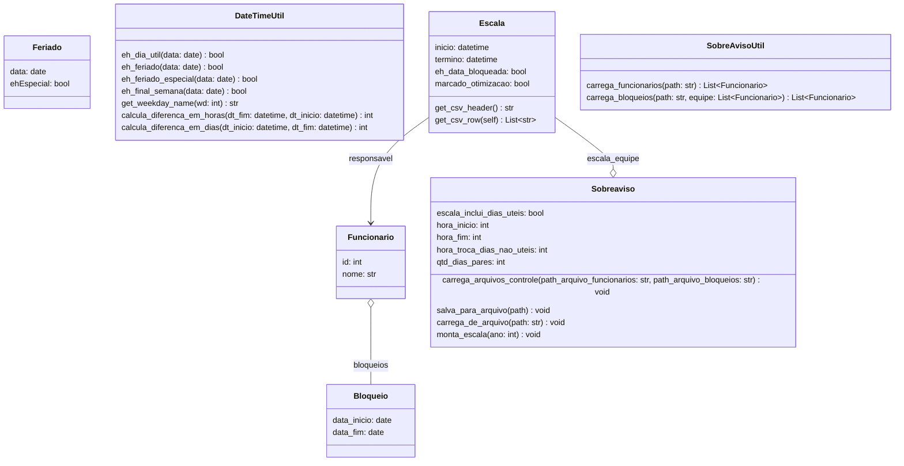

```mermaid
classDiagram
class Feriado{
data: date
ehEspecial: bool
}

class DateTimeUtil{
eh_dia_util(data: date) bool
eh_feriado(data: date) bool
eh_feriado_especial(data: date) bool
eh_final_semana(data: date) bool
get_weekday_name(wd: int) str
calcula_diferenca_em_horas(dt_fim: datetime, dt_inicio: datetime) int
calcula_diferenca_em_dias(dt_inicio: datetime, dt_fim: datetime) int
}

class Bloqueio {
data_inicio: date
data_fim: date
}

class Funcionario{
id: int
nome: str
}
Funcionario o-- Bloqueio : bloqueios

class Escala{
 inicio: datetime
 termino: datetime
 eh_data_bloqueada: bool
 marcado_otimizacao: bool
 
 get_csv_header() str
 get_csv_row(self) List~str~
}
Escala --> Funcionario: responsavel

class SobreAvisoUtil {
 carrega_funcionarios(path: str) List~Funcionario~
 carrega_bloqueios(path: str, equipe: List~Funcionario~)  List~Funcionario~
}

class Sobreaviso{
 escala_inclui_dias_uteis: bool
 hora_inicio: int
 hora_fim: int
 hora_troca_dias_nao_uteis: int
 qtd_dias_pares: int      
 
 carrega_arquivos_controle(path_arquivo_funcionarios: str, path_arquivo_bloqueios: str) void
 salva_para_arquivo(path) void
 carrega_de_arquivo(path: str) void
 monta_escala(ano: int) void
}
Escala --o Sobreaviso: escala_equipe
```
