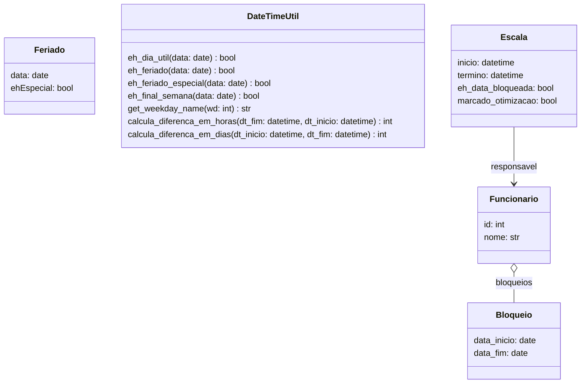

```mermaid
classDiagram
class Feriado{
data: date
ehEspecial: bool
}

class DateTimeUtil{
eh_dia_util(data: date) bool
eh_feriado(data: date) bool
eh_feriado_especial(data: date) bool
eh_final_semana(data: date) bool
get_weekday_name(wd: int) str
calcula_diferenca_em_horas(dt_fim: datetime, dt_inicio: datetime) int
calcula_diferenca_em_dias(dt_inicio: datetime, dt_fim: datetime) int
}

class Bloqueio {
data_inicio: date
data_fim: date
}

class Funcionario{
id: int
nome: str
}
Funcionario o-- Bloqueio : bloqueios

class Escala{
 inicio: datetime
 termino: datetime
 eh_data_bloqueada: bool
 marcado_otimizacao: bool
}
Escala --> Funcionario: responsavel
```
